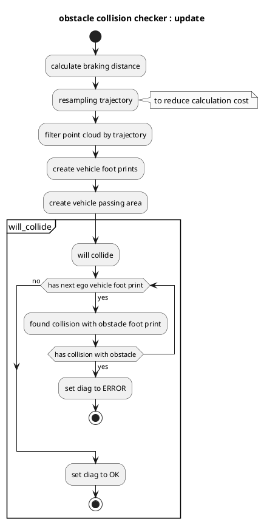

# obstacle_collision_checker

## Purpose

`obstacle_collision_checker` is a module to check obstacle collision for predicted path.

## Inner-workings / Algorithms

### Flow chart

### Algorithms

### Check data

Check that `obstacle_collision_checker` receives no ground pointcloud, predicted_trajectory, reference trajectory, and current velocity data.

### Get distance to nearest object

Calculate distance between ego vehicle and the nearest object.
In this function, it calculates the minimum distance between the polygon of ego vehicle and all points in pointclouds.

### Stop requirement

## Inputs / Outputs

### Input

| Name                                  | Type                                           | Description          |
| ------------------------------------- | ---------------------------------------------- | -------------------- |
| `~/input/trajectory`                  | `autoware_auto_planning_msgs::msg::Trajectory` | Reference trajectory |
| `~/input/trajectory`                  | `autoware_auto_planning_msgs::msg::Trajectory` | Predicted trajectory |
| `/sensing/lidar/no_ground/pointcloud` | `sensor_msgs::msg::PointCloud2`                | No ground pointcloud |
| `/localization/twist`                 | `geometry_msgs::msg::TwistStamped`             | Current twist        |
| `/tf`                                 | `tf2_msgs::msg::TFMessage`                     | TF                   |
| `/tf_static`                          | `tf2_msgs::msg::TFMessage`                     | TF static            |

### Output

| Name                       | Type                                           | Description              |
| -------------------------- | ---------------------------------------------- | ------------------------ |
| `~/output/trajectory`      | `autoware_planning_msgs/Trajectory`            | Modified trajectory      |
| `~/output/no_start_reason` | `diagnostic_msgs::msg::DiagnosticStatus`       | No start reason          |
| `~/output/stop_reasons`    | `autoware_planning_msgs::msg::StopReasonArray` | Stop reasons             |
| `~/debug/marker`           | `visualization_msgs::msg::MarkerArray`         | Marker for visualization |

## Parameters

| Name                | Type     | Description                                      | Default value |
| :------------------ | :------- | :----------------------------------------------- | :------------ |
| `delay_time`        | `bool`   | delay time for collision prediction              | `true`        |
| `footprint_margin`  | `bool`   | foot print margin                                | `true`        |
| `max_deceleration`  | `double` | max deceleration for ego vehicle to stop [m/s^2] | 0.5           |
| `resample_interval` | `double` | interval for resampling trajectory [m]           | 0.8           |
| `search_radius`     | `double` | search radius for [m]                            | 2.0           |

## Assumptions / Known limits

To perform stop planning, it is necessary to get obstacle pointclouds data.
Hence, it does not plan stopping if the obstacle is in blind spot.
